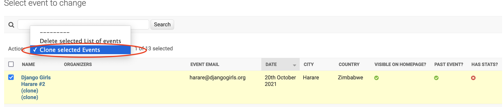

# How to duplicate an event

Every now and then organizers in regions where English is not the main language request to have 2 websites, an English version and a non-English one. For example, Django Girls Geneva has requested twice to have a French and an English website. For a while, we have manually created the event, copying the details from the event created when the event application was approved and deployed. This takes time and is a bit frustrating for the person doing it. 

Since April, 11th, 2022, we have added
an action in the Event admin to duplicate an event automatically. It copies everything else, add `_clone` to the `page_url` field of the new event to avoid the `MultipleObjectsReturned - Expected 1 Get returned 2 objects` error. While the main organizer is copied, the `team` field which relies on `foreign keys` is not copied because the `id` of the new event is `None` when it is created. 

This means the person duplicating the event should change the `page_url` fields to appropriate urls for both the original event, for example, to `geneva_fr` for the French version and `geneva_en` for the English version. They also need to copy the team from the original event as well. These are the only 2 bits that still need human intervention.

The instructions for duplicating an event are as follows:
1. Log in to [Django Girls Admin](https://djangogirls.org/en/admin/).
2. Click on the `List of Events` link in the left pane.
3. Select the event you want to duplicate.
4. Open the dropdown menu in the Action on top to select the `Clone selected Events` option as shown in the image below. 

5. Click `Go` as shown below. The process will only take a few seconds.

6. As shown below, the organizers sections will be empty and will be filled by you copying manually the `Team` section from the event you just cloned.

7. Click on the new event which has `_clone` at the end of the name. Select the team members to populate the organizers list.
8. Also change the website URL as shown below.

Yay! You have duplicated an event!  
