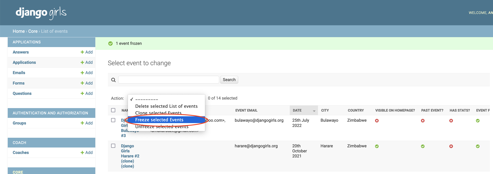
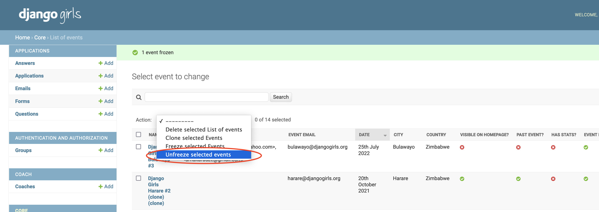
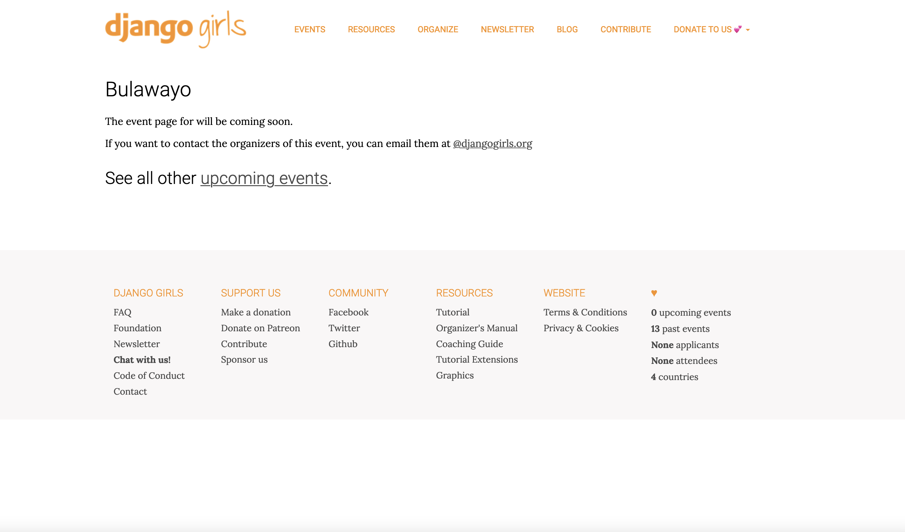

# How to freeze/unfreeze event(s)
Every now and then we experience challenges with event organizers who violate our terms and conditions or guidelines for organizing and running Django Girls workshops. Since Django Girls is a registered trademark and permission to use the name Django Girls and our infrastructure is subject to permission being granted, therefore we reserve the rights to cancel or revoke events who violate our terms and conditions. 

Prior to April, 27th, 2022, the only way to revoke was to delete the event(s), which somehow felt drastic for us as a foundation as it would be difficult to create the event again if they ended up co-operating. Not deleting the event, hoping the organizers would eventually co-operate also somehow left us at the mercy of event organizers who may end up not co-operating at all, therefore tarnishing the Django Girls name in the community.

As of April, 27th, 2022, we have added functionality to our website admin to enable the freezing/disabling of an event which violates our terms and conditions while the organizers are implementing our recommended guidelines. Once they have met our requirements, there is functionality to enable the unfreezing of the event. This gives us control with minimum labour on our awesomeness ambassador's part.

Below we outline, how to freeze and unfreeze an event.

## How to freeze event(s)
To freeze event(s):

1. Click on `List of events`.
2. Select the event(s) you want to freeze/disable.
3. Click on the `Action` select box and select `Freeze selected Events` option as shown in the image below.

4. Click `Go` button and you will freeze the events.

## How to unfreeze event(s)
To unfreeze event(s):

1. 1. Click on `List of events`.
2. Select the event(s) you want to unfreeze/enable.
3. Click on the `Action` select box and select `Unfreeze selected events` option as shown in the image below.

4. Click `Go` button and you will unfreeze the events.

## What does it mean to have an event which is frozen?
1. It is treated as a past event therefore it does not appear on the website homepage as an upcoming event. This is because past events do not appear on the website.
2. The event website is not visible to the public. It is handled the same way an event which does not have open applications or have a website  which is ready is treated. This means sponsors who are wondering whether or not to support the event will not be able to access the event website so will not think we are endorsing an event with dubious organizers. Visitors will see the page shown below.

Do this and you're all set to deal with problem events!